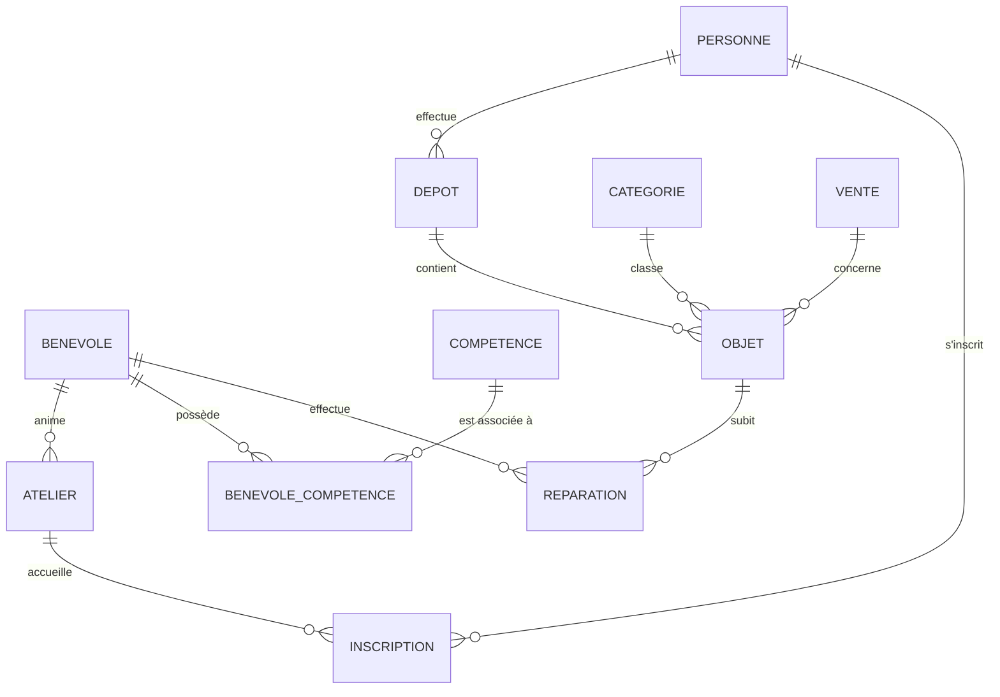

# MLD — La Remise

Modèle logique de données de la base `laremise_db` (11 tables)s

## Vue d'ensemble

| Table                 | Description                            |
| --------------------- | -------------------------------------- |
| `personne`            | Donatrices et acheteuses               |
| `benevole`            | Bénévoles du magasin                   |
| `competence`          | Compétences des bénévoles              |
| `categorie`           | Catégories d'objets                    |
| `vente`               | Ventes réalisées                       |
| `depot`               | Dépôts d'objets (boutique ou domicile) |
| `atelier`             | Ateliers de réparation / formation     |
| `benevole_competence` | Association bénévole ↔ compétence      |
| `objet`               | Objets déposés, en réparation, vendus… |
| `inscription`         | Inscriptions aux ateliers              |
| `reparation`          | Réparations effectuées sur les objets  |

## Diagramme entités-associations

## Détail des tables

### `personne`

| Champ     | Type         | Contraintes              |
| --------- | ------------ | ------------------------ |
| **id**    | INT          | PK                       |
| nom       | VARCHAR(100) | NOT NULL                 |
| prenom    | VARCHAR(100) | NOT NULL                 |
| telephone | VARCHAR(20)  |                          |
| adherente | BOOLEAN      | NOT NULL · DEFAULT false |

### `benevole`

| Champ        | Type         | Contraintes |
| ------------ | ------------ | ----------- |
| **id**       | INT          | PK          |
| nom          | VARCHAR(100) | NOT NULL    |
| prenom       | VARCHAR(100) | NOT NULL    |
| telephone    | VARCHAR(20)  |             |
| date_arrivee | DATE         | NOT NULL    |

### `competence`

| Champ   | Type         | Contraintes       |
| ------- | ------------ | ----------------- |
| **id**  | INT          | PK                |
| libelle | VARCHAR(100) | NOT NULL · UNIQUE |

### `categorie`

| Champ   | Type         | Contraintes       |
| ------- | ------------ | ----------------- |
| **id**  | INT          | PK                |
| libelle | VARCHAR(100) | NOT NULL · UNIQUE |

### `vente`

| Champ         | Type          | Contraintes     |
| ------------- | ------------- | --------------- |
| **id**        | INT           | PK              |
| date_vente    | DATE          | NOT NULL        |
| mode_paiement | mode_paiement | NOT NULL · enum |

### `depot`

| Champ       | Type       | Contraintes                   |
| ----------- | ---------- | ----------------------------- |
| **id**      | INT        | PK                            |
| date_depot  | DATE       | NOT NULL                      |
| type        | type_depot | NOT NULL · enum               |
| personne_id | INT        | NOT NULL · FK → `personne.id` |

### `atelier`

| Champ       | Type          | Contraintes                   |
| ----------- | ------------- | ----------------------------- |
| **id**      | INT           | PK                            |
| intitule    | VARCHAR(255)  | NOT NULL                      |
| date_debut  | DATE          | NOT NULL                      |
| duree       | NUMERIC(4, 1) | NOT NULL                      |
| places      | INT           | NOT NULL                      |
| benevole_id | INT           | NOT NULL · FK → `benevole.id` |

### `benevole_competence`

| Champ         | Type | Contraintes                         |
| ------------- | ---- | ----------------------------------- |
| benevole_id   | INT  | PK · FK → `benevole.id` (CASCADE)   |
| competence_id | INT  | PK · FK → `competence.id` (CASCADE) |

### `objet`

| Champ           | Type          | Contraintes                          |
| --------------- | ------------- | ------------------------------------ |
| **id**          | INT           | PK                                   |
| libelle         | VARCHAR(255)  | NOT NULL                             |
| poids_kg        | NUMERIC(6, 2) | NOT NULL                             |
| etat_arrivee    | etat_objet    | NOT NULL · enum                      |
| statut          | statut_objet  | NOT NULL · DEFAULT `'arrive'` · enum |
| prix            | NUMERIC(8, 2) |                                      |
| date_mise_rayon | DATE          |                                      |
| categorie_id    | INT           | NOT NULL · FK → `categorie.id`       |
| depot_id        | INT           | NOT NULL · FK → `depot.id`           |
| vente_id        | INT           | NULLABLE · FK → `vente.id`           |
| prix_paye       | NUMERIC(8, 2) |                                      |

### `inscription`

| Champ            | Type    | Contraintes                       |
| ---------------- | ------- | --------------------------------- |
| personne_id      | INT     | PK · FK → `personne.id` (CASCADE) |
| atelier_id       | INT     | PK · FK → `atelier.id` (CASCADE)  |
| date_inscription | DATE    | NOT NULL                          |
| presente         | BOOLEAN | NOT NULL · DEFAULT false          |

### `reparation`

| Champ       | Type                | Contraintes                   |
| ----------- | ------------------- | ----------------------------- |
| **id**      | INT                 | PK                            |
| date_repa   | DATE                | NOT NULL                      |
| duree_h     | NUMERIC(4, 1)       | NOT NULL                      |
| resultat    | resultat_reparation | NOT NULL · enum               |
| objet_id    | INT                 | NOT NULL · FK → `objet.id`    |
| benevole_id | INT                 | NOT NULL · FK → `benevole.id` |

## Relations (clés étrangères)

| Table                 | Colonne         | Référence               |
| --------------------- | --------------- | ----------------------- |
| `depot`               | `personne_id`   | → `personne.id`         |
| `atelier`             | `benevole_id`   | → `benevole.id`         |
| `benevole_competence` | `benevole_id`   | → `benevole.id`         |
| `benevole_competence` | `competence_id` | → `competence.id`       |
| `objet`               | `categorie_id`  | → `categorie.id`        |
| `objet`               | `depot_id`      | → `depot.id`            |
| `objet`               | `vente_id`      | → `vente.id` (NULLABLE) |
| `inscription`         | `personne_id`   | → `personne.id`         |
| `inscription`         | `atelier_id`    | → `atelier.id`          |
| `reparation`          | `objet_id`      | → `objet.id`            |
| `reparation`          | `benevole_id`   | → `benevole.id`         |

## Énumérations

| Type                  | Valeurs                                                   |
| --------------------- | --------------------------------------------------------- |
| `type_depot`          | `boutique`, `domicile`                                    |
| `etat_objet`          | `bon_etat`, `a_reparer`, `hors_service`                   |
| `statut_objet`        | `arrive`, `en_reparation`, `en_rayon`, `vendu`, `recycle` |
| `resultat_reparation` | `reussie`, `echouee`                                      |
| `mode_paiement`       | `especes`, `carte`, `cheque`                              |
